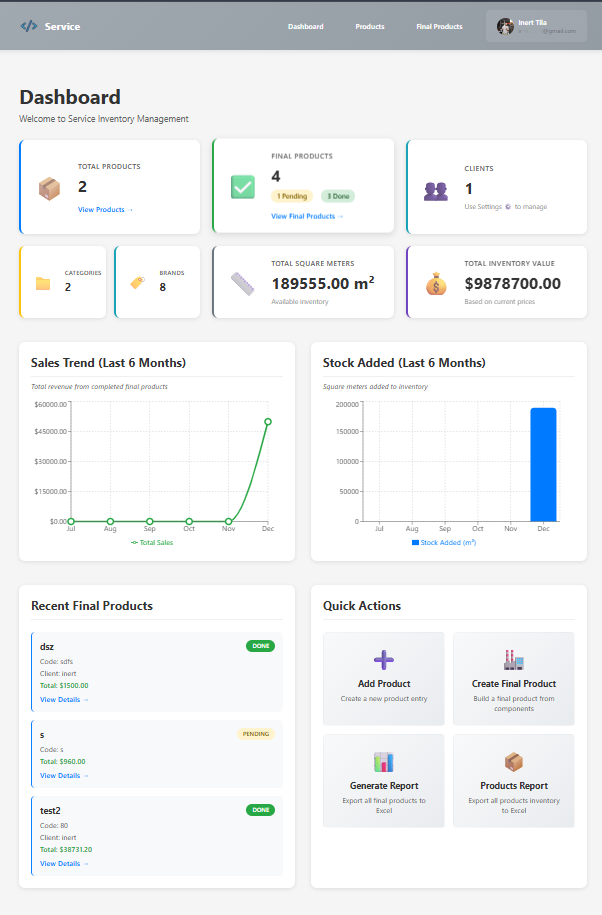

# Inventory Management System



A full-stack inventory management application for managing products, creating final products with component-based pricing, and handling multi-currency transactions. Built with user authentication and multi-tenant support.

## Features

- **User Authentication**: Secure authentication using Stack Auth with user-specific data isolation
- **Product Management**: Create, edit, and delete products with:
  - Barcode tracking
  - Price per square meter
  - Square meters measurement
  - Multi-currency support
  - Product descriptions
- **Category Management**: Organize products with custom categories
- **Final Products**: Create composite products with:
  - Multiple component selection
  - Automatic price calculation based on components
  - Client association
  - Status tracking (pending/done)
  - Date management
  - Tax (TVSH) application option
  - Component image uploads
- **Currency Management**: Support for multiple currencies with custom symbols and codes
- **Client Management**: Manage client information (name, contact, email, address)
- **Image Upload**: Upload images for product components
- **Excel Export**: Export data to Excel format (xlsx support)
- **Modern UI**: Clean, responsive design with notification system

## Tech Stack

- **Backend**: 
  - Node.js with Express.js
  - PostgreSQL with Sequelize ORM
  - Multer for file uploads
  - Stack Auth integration for authentication
- **Frontend**: 
  - React.js with React Router
  - Stack Auth (@stackframe/react) for authentication
  - Axios for API calls
  - xlsx libraries for Excel export
- **Database**: PostgreSQL with user-scoped data

## Prerequisites

- Node.js (v14 or higher)
- PostgreSQL (local installation or cloud database)
- npm or yarn
- Stack Auth account and project (for authentication)

## Installation

1. **Clone or navigate to the project directory**

2. **Install backend dependencies:**
   ```bash
   npm install
   ```

3. **Install frontend dependencies:**
   ```bash
   cd client
   npm install
   cd ..
   ```

4. **Set up PostgreSQL database:**
   - Create a PostgreSQL database named `inventory_app` (or your preferred name)
   - You can use the following SQL command:
     ```sql
     CREATE DATABASE inventory_app;
     ```

5. **Set up environment variables:**
   
   **Backend (.env in root directory):**
   - Copy `.env.example` to `.env`:
     ```bash
     cp .env.example .env
     ```
   - Edit `.env` and update with your PostgreSQL credentials:
     ```
     DB_HOST=localhost
     DB_PORT=5432
     DB_NAME=inventory_app
     DB_USER=postgres
     DB_PASSWORD=your_password
     PORT=5000
     ```
   - For cloud PostgreSQL (like Heroku, AWS RDS, etc.), update the connection details accordingly

   **Frontend (client/.env.local):**
   - Create `client/.env.local` file:
     ```
     REACT_APP_API_URL=http://localhost:5000
     REACT_APP_STACK_PROJECT_ID=your_stack_project_id
     REACT_APP_STACK_PUBLISHABLE_CLIENT_KEY=your_stack_publishable_key
     ```
   - Get your Stack Auth credentials from [Stack Auth Dashboard](https://stack-auth.com)

## Running the Application

### Development Mode

1. **Start PostgreSQL** (if using local PostgreSQL):
   - Make sure PostgreSQL is running on your system
   - The database will be automatically created/synced when you start the server

2. **Start the backend server:**
   ```bash
   npm run dev
   ```
   The server will run on `http://localhost:5000`

3. **Start the frontend (in a new terminal):**
   ```bash
   npm run client
   ```
   The React app will open in your browser at `http://localhost:3000`

### Development Mode with Docker

The easiest way to run the application in development is using Docker Compose. This ensures a consistent environment and doesn't require local PostgreSQL setup.

#### Prerequisites
- Docker and Docker Compose installed

#### Quick Start

1. **Start all services (PostgreSQL, Backend, Frontend):**
   ```bash
   docker-compose up --build
   ```
   
   Or run in detached mode (background):
   ```bash
   docker-compose up -d --build
   ```

2. **Access the application:**
   - Frontend: `http://localhost:3000`
   - Backend API: `http://localhost:5000`
   - Database: `localhost:5432` (internal Docker network)

#### Development Docker Commands

```bash
# Start all services
docker-compose up

# Start in background (detached mode)
docker-compose up -d

# Rebuild and start (after code changes)
docker-compose up --build

# Stop all services
docker-compose down

# Stop and remove volumes (⚠️ deletes database data)
docker-compose down -v

# View logs
docker-compose logs -f

# View specific service logs
docker-compose logs -f backend
docker-compose logs -f frontend
docker-compose logs -f postgres

# Restart a specific service
docker-compose restart backend
docker-compose restart frontend
```

#### Development Features

- **Hot Reload**: Backend uses nodemon for automatic restarts on code changes
- **React Dev Server**: Frontend runs with React's development server with hot module replacement
- **Automatic Database Setup**: PostgreSQL container initializes automatically
- **Volume Mounting**: Code changes are reflected immediately (if volumes are configured)
- **Isolated Environment**: No need to install PostgreSQL or Node.js locally

#### Development Docker Files

- `Dockerfile` - Development backend Dockerfile
- `client/Dockerfile` - Development frontend Dockerfile
- `docker-compose.yml` - Development docker-compose configuration

#### Notes for Docker Development

- The database persists in the `postgres_data` volume
- Uploaded files persist in the `uploads` volume
- Environment variables are set in `docker-compose.yml`
- Code changes require container restart (or use volume mounts for live reload)

### Production Mode (Local)

1. **Build the React app:**
   ```bash
   npm run build
   ```

2. **Start the server:**
   ```bash
   npm start
   ```

   The app will be served from the Express server on `http://localhost:5000`

### Production Deployment with Docker

The project includes production-ready Docker configurations for easy deployment.

#### Prerequisites
- Docker and Docker Compose installed
- Environment variables configured

#### Quick Start

1. **Set up environment variables:**
   Create a `.env.prod` file in the root directory (or export them):
   ```bash
   DB_PASSWORD=your_secure_database_password
   STACK_SECRET_SERVER_KEY=your_stack_secret_server_key
   REACT_APP_STACK_PROJECT_ID=your_stack_project_id
   REACT_APP_STACK_PUBLISHABLE_CLIENT_KEY=your_stack_publishable_client_key
   REACT_APP_API_URL=http://your-domain.com:5000
   BACKEND_PORT=5000
   FRONTEND_PORT=80
   DB_PORT=5432
   ```

2. **Build and start production containers:**
   ```bash
   docker-compose -f docker-compose.prod.yml --env-file .env.prod up --build -d
   ```

3. **Access the application:**
   - Frontend: `http://localhost` (or your configured port)
   - Backend API: `http://localhost:5000` (or your configured port)

#### Production Features

- **Optimized Builds**: Multi-stage Docker builds for smaller image sizes
- **Nginx Frontend**: Frontend served via nginx with gzip compression and caching
- **Production Dependencies**: Only production dependencies installed in final images
- **Health Checks**: Database health checks ensure proper startup order
- **Isolated Networks**: Services communicate via Docker network
- **Persistent Volumes**: Database and uploads stored in Docker volumes

#### Production Docker Files

- `Dockerfile.prod` - Production backend Dockerfile
- `client/Dockerfile.prod` - Production frontend Dockerfile with nginx
- `client/nginx.conf` - Nginx configuration for frontend
- `docker-compose.prod.yml` - Production docker-compose configuration

#### Stopping Production Containers

```bash
docker-compose -f docker-compose.prod.yml down
```

#### Viewing Logs

```bash
# All services
docker-compose -f docker-compose.prod.yml --env-file .env.prod up --build -d

# Specific service
docker-compose -f docker-compose.prod.yml logs -f backend
docker-compose -f docker-compose.prod.yml logs -f frontend
docker-compose -f docker-compose.prod.yml logs -f postgres
```

#### Important Notes for Production

1. **API URL Configuration**: Update `REACT_APP_API_URL` in your `.env.prod` to match your production domain
2. **Database Password**: Use a strong, secure password for production
3. **Stack Auth Keys**: Ensure your Stack Auth keys are production keys
4. **HTTPS**: For production, consider using a reverse proxy (like Traefik or nginx) with SSL certificates
5. **Backups**: Regularly backup the `postgres_data_prod` volume
6. **Security**: Review and update security headers in `client/nginx.conf` as needed

## Usage

1. **Sign In/Sign Up**:
   - The app requires authentication via Stack Auth
   - First-time users will be redirected to sign up
   - Existing users can sign in with their credentials

2. **Configure Settings**:
   - Click the settings icon (⚙) in the navbar
   - **Add Currencies**: Create currencies with code, name, and symbol (e.g., USD, EUR, ALL)
   - **Add Clients**: Manage client information for final products

3. **Add Products**:
   - Go to the "Products" page
   - Click "+ Add Product"
   - Fill in product details:
     - Name and barcode (unique per user)
     - Price per square meter
     - Square meters
     - Select currency
     - Optional description
   - Save the product

4. **Create Final Products**:
   - Navigate to "Final Products"
   - Click "+ Add Final Product"
   - Enter product details (name, code, description)
   - Select currency and optional client
   - Set date and status (pending/done)
   - Toggle TVSH (tax) application if needed
   - Add components by selecting products and specifying quantities
   - Upload images for components (optional)
   - The total price is automatically calculated based on component prices and quantities
   - Save the final product

## API Endpoints

All endpoints require authentication via `X-User-Id` header (automatically handled by the frontend).

### Products
- `GET /api/products` - Get all products (user-specific)
- `GET /api/products/:id` - Get single product
- `POST /api/products` - Create product
- `PUT /api/products/:id` - Update product
- `DELETE /api/products/:id` - Delete product

### Categories
- `GET /api/categories` - Get all categories (user-specific)
- `GET /api/categories/:id` - Get single category
- `POST /api/categories` - Create category
- `PUT /api/categories/:id` - Update category
- `DELETE /api/categories/:id` - Delete category

### Final Products
- `GET /api/final-products` - Get all final products (user-specific)
- `GET /api/final-products/:id` - Get single final product
- `POST /api/final-products` - Create final product
- `PUT /api/final-products/:id` - Update final product
- `DELETE /api/final-products/:id` - Delete final product

### Currencies
- `GET /api/currencies` - Get all currencies (user-specific)
- `GET /api/currencies/:id` - Get single currency
- `POST /api/currencies` - Create currency
- `PUT /api/currencies/:id` - Update currency
- `DELETE /api/currencies/:id` - Delete currency

### Clients
- `GET /api/clients` - Get all clients (user-specific)
- `GET /api/clients/:id` - Get single client
- `POST /api/clients` - Create client
- `PUT /api/clients/:id` - Update client
- `DELETE /api/clients/:id` - Delete client

### Upload
- `POST /api/upload/component-image` - Upload component image (multipart/form-data)

## Project Structure

```
inventory-hub/
├── server/
│   ├── config/
│   │   ├── database.js          # Sequelize configuration
│   │   └── upload.js             # Multer configuration
│   ├── middleware/
│   │   └── auth.js               # Authentication middleware
│   ├── migrations/
│   │   └── add-userId-columns.js # Database migration
│   ├── models/
│   │   ├── Product.js            # Product model
│   │   ├── Category.js           # Category model
│   │   ├── FinalProduct.js       # Final product model
│   │   ├── Component.js          # Component junction model
│   │   ├── Currency.js           # Currency model
│   │   ├── Client.js             # Client model
│   │   └── index.js              # Model associations
│   ├── routes/
│   │   ├── products.js           # Product routes
│   │   ├── categories.js         # Category routes
│   │   ├── finalProducts.js      # Final product routes
│   │   ├── currencies.js         # Currency routes
│   │   ├── clients.js            # Client routes
│   │   └── upload.js             # File upload routes
│   └── index.js                  # Express server entry point
├── client/
│   ├── public/
│   │   └── index.html
│   ├── src/
│   │   ├── components/
│   │   │   ├── Products.js       # Product management component
│   │   │   ├── Categories.js     # Category management component
│   │   │   ├── FinalProducts.js  # Final product management component
│   │   │   ├── Settings.js        # Settings component
│   │   │   ├── Notification.js   # Notification component
│   │   │   └── ConfirmDialog.js  # Confirmation dialog component
│   │   ├── context/
│   │   │   ├── CurrencyContext.js    # Currency state management
│   │   │   ├── NotificationContext.js # Notification state
│   │   │   └── UserContext.js        # User state management
│   │   ├── stack/
│   │   │   └── client.js         # Stack Auth client configuration
│   │   ├── utils/
│   │   │   └── axiosConfig.js    # Axios configuration
│   │   ├── App.js                # Main app component
│   │   └── index.js              # React entry point
│   └── package.json
├── uploads/                      # Uploaded images directory (created automatically)
├── package.json
└── README.md
```

## Notes

- Make sure PostgreSQL is running before starting the server
- The database tables will be automatically created/synced on first run (using `sequelize.sync({ alter: true })`)
- All data is user-scoped - each user only sees and manages their own data
- Product barcodes must be unique per user
- Final product codes must be unique per user
- Currency codes must be unique per user
- Final products automatically calculate total price from components based on:
  - Component price per square meter
  - Component square meters
  - Component quantity
- Images are stored in the `uploads/` directory and served at `/uploads/:filename`
- The app uses Stack Auth for authentication - make sure to configure your Stack Auth project

## Database Schema

The application uses the following PostgreSQL tables (all with `userId` for multi-tenant support):

- `categories` - Product categories (userId, name, description)
- `products` - Individual products/components (userId, name, barcode, price_per_square_meter, square_meters, description, currencyId)
- `final_products` - Final products (userId, name, code, description, currencyId, clientId, status, date, applyTVSH)
- `components` - Junction table linking final products to component products (finalProductId, productId, quantity, imagePath)
- `currencies` - Currency definitions (userId, code, name, symbol)
- `clients` - Client information (userId, fullName, number, email, address)

## Authentication

The app uses [Stack Auth](https://stack-auth.com) for user authentication:
- Users must sign in/sign up to access the application
- All API requests include the user ID in the `X-User-Id` header
- Backend middleware validates the user ID for all protected routes
- Each user's data is isolated by `userId` in the database

## Development

- Backend runs on `http://localhost:5000`
- Frontend runs on `http://localhost:3000` (development mode)
- In production, the React app is built and served from the Express server
- Database migrations run automatically on server start

## License

ISC


